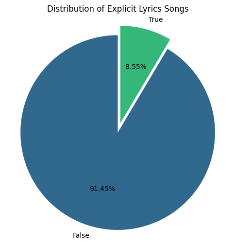
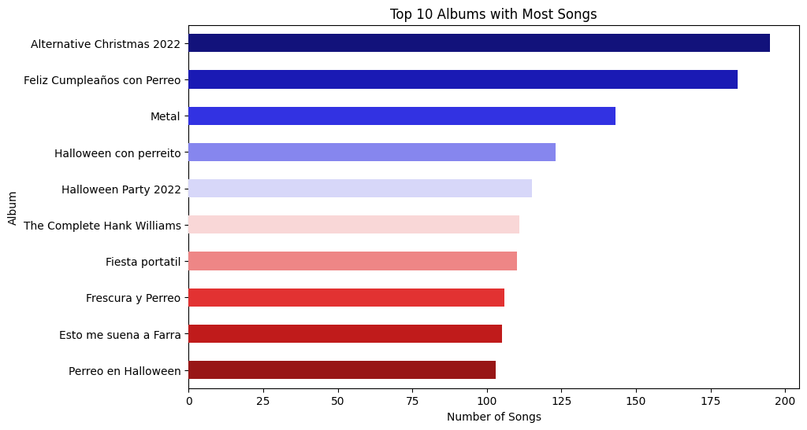
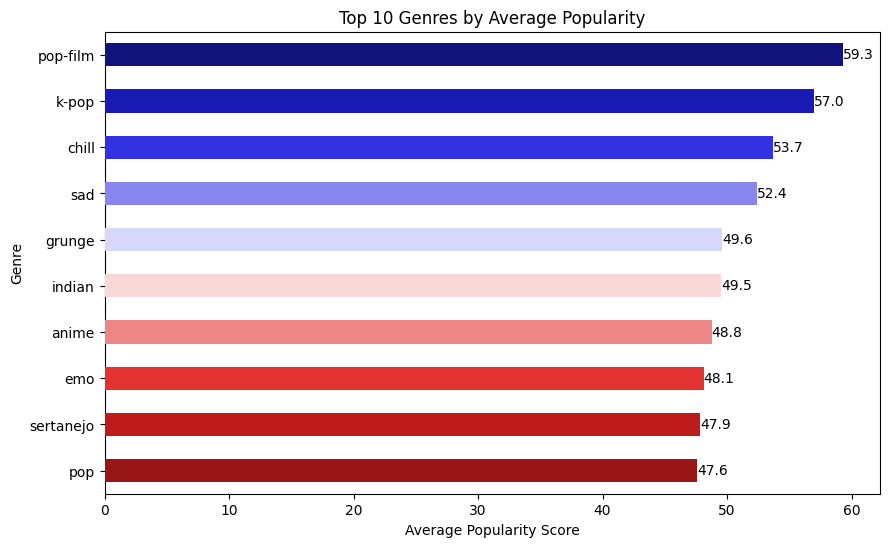
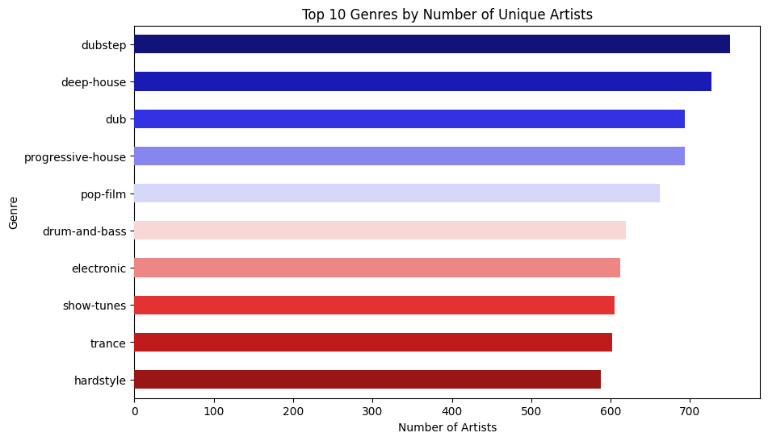
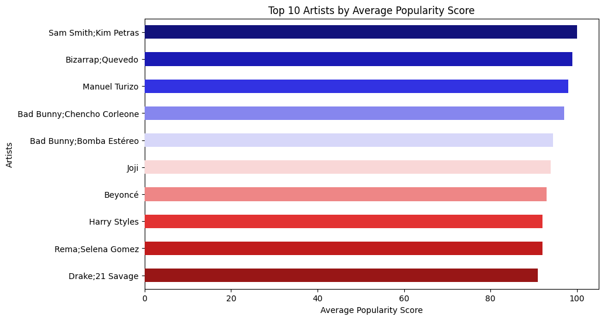
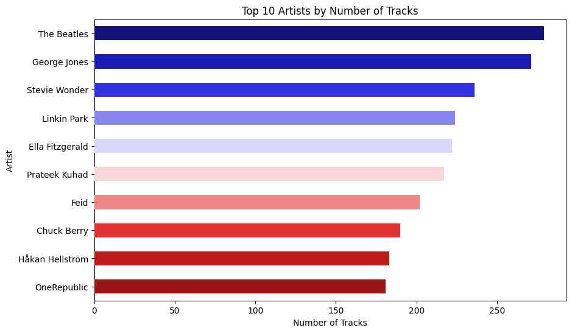
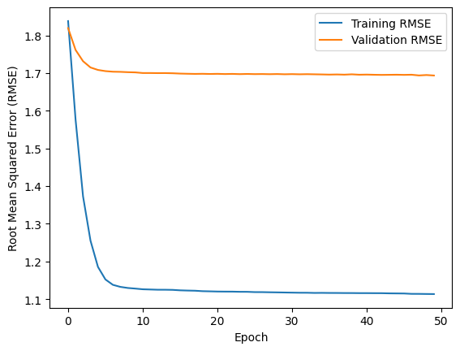

# Machine Learning Project Report - Ridwan Halim

[](https://wakatime.com/badge/user/018b799e-de53-4f7a-bb65-edc2df9f26d8/project/45c71873-666f-4140-a133-d302f409bd33)

# Project Overview

## Background
In the era of digital music streaming[1], the sheer volume of available tracks can be overwhelming for users. Music recommendation systems have become essential tools for helping users discover new music that aligns with their tastes[2]. These systems analyze user preferences and listening habits to suggest tracks, artists, and albums that users are likely to enjoy.

## Importance
Completing this project is crucial for several reasons:
1. **Enhanced User Experience**: A well-designed recommendation system can significantly improve user satisfaction by providing personalized music suggestions.
2. **Increased Engagement**: By offering relevant recommendations, users are more likely to spend more time on the platform, exploring new music.
3. **Revenue Growth**: For music streaming services, increased user engagement often translates to higher subscription rates and ad revenue.
4. **Competitive Advantage**: A robust recommendation system can set a music streaming service apart from its competitors, attracting and retaining more users.

## Research and References

Research and references at the bottom on this MD

# Business Understanding

## Problem Statements
1. **Top 10**: What are the Top 10 Albums with Most Songs, Top 10 Music Genres Based on Highest Average Popularity, Top 10 Genres with the Highest Number of Unique Artists, Top 10 Artists by Average Popularity Score, and Top 10 Artists by Number of Tracks?
2. **Recommendation System**: How can we create the best recommendation system that can be implemented?

## Goals
The primary goals of this project are:
1. **Data Analysis and Insights**:
   - Identify the **Top 10 Albums** with the most songs.
   - Determine the **Top 10 Music Genres** based on the highest average popularity.
   - Find the **Top 10 Genres** with the highest number of unique artists.
   - Identify the **Top 10 Artists** by average popularity score.
   - Determine the **Top 10 Artists** by the number of tracks.

   These tasks aim to provide insights into the music dataset, highlighting popular albums, genres, and artists based on various metrics.

2. **Create a Recommendation System**:
   - Implement a recommendation system using Content-based Filtering to suggest music based on track features.
   - Implement a recommendation system using Collaborative Filtering to suggest music based on user interaction data.

## Solution Approach
To achieve these goals, we propose the following steps:

1. **Data Analysis and Insights**:
   - Use descriptive statistics and visualizations to identify the top albums, genres, and artists.
   - Apply aggregation and sorting techniques to determine the top 10 entities based on various metrics.

2. **Create a Recommendation System**:
   - **Content-based Filtering**:
     - Prepare the data by extracting relevant features such as track name, album name, and genre.
     - Create a TF-IDF matrix to represent the textual data numerically.
     - Calculate cosine similarity between tracks to identify similar items.
     - Develop a recommendation model using the similarity scores to suggest tracks.

   - **Collaborative Filtering**:
     - Encode categorical data such as track IDs and names into numerical values.
     - Normalize the popularity scores to a standard range.
     - Split the data into training and validation sets.
     - Train a neural network model to learn user-item interactions and generate recommendations based on predicted popularity scores.

# Data Understanding

## Data Overview
The dataset used in this project contains 114,000 rows and 21 columns. The data includes various features such as track ID, artists, album name, track name, popularity, duration, explicit content indicator, and several audio features.

## Data Source
The dataset can be downloaded from the following link:
[Spotify Tracks Dataset](https://raw.githubusercontent.com/ridwaanhall/applied-machine-learning/refs/heads/main/recomendation-system/spotify-tracks-dataset/dataset.csv)

## Variable Description
| Variable          | Description                                                                 |
|-------------------|----------------------------------------------------------------------------|
| track_id          | Unique identifier for the track on Spotify                                 |
| artists           | Artists associated with the track, separated by `;` if there is more than one artist |
| album_name        | Name of the album in which the track is featured                           |
| track_name        | Title of the track                                                         |
| popularity        | Popularity score of the track on a scale from 0 to 100, based on total number of plays |
| duration_ms       | Duration of the track measured in milliseconds                             |
| explicit          | Indicator of whether the track contains explicit lyrics (true = yes, false = no) |
| danceability      | Measure of the suitability of the track for dancing on a scale from 0 to 1, with 0 being not suitable and 1 being highly suitable |
| energy            | Measure of the intensity and activity of the track on a scale from 0 to 1, with 0 being very low and 1 being very high |
| key               | Key of the track using standard Pitch Class notation, e.g., 0 = C, 1 = C#, 2 = D |
| loudness          | Loudness of the track measured in decibels (dB)                            |
| mode              | Mode of the track's melodic content, with 0 indicating minor and 1 indicating major |
| speechiness       | Measure of the presence of spoken words in the track on a scale from 0 to 1, with 0 being rare and 1 being frequent |
| acousticness      | Confidence measure of whether the track is acoustic on a scale from 0 to 1, with 0 being no and 1 being yes |
| instrumentalness  | Measure of the instrumental nature of the track on a scale from 0 to 1, with 0 being not instrumental and 1 being purely instrumental |
| liveness          | Measure of the presence of a live audience in the track on a scale from 0 to 1, with 0 being no audience and 1 being a live audience |
| valence           | Measure of the musical positiveness conveyed by the track on a scale from 0 to 1, with 0 being negative (e.g., sad, angry) and 1 being positive (e.g., happy, euphoric) |
| tempo             | Tempo of the track measured in beats per minute                            |
| time_signature    | Time signature of the track, indicating the number of beats per measure, e.g., 4 represents a 4/4 time signature |
| track_genre       | Genre of the track                                                         |

## Data Visualization and Insights
- **Distribution of Explicit Lyrics Songs**: 8.55% of the songs in the dataset have explicit lyrics.


- **Top 10 Albums with Most Songs**: "Alternative Christmas 2022" has the most songs with over 175 tracks.


- **Top 10 Music Genres Based on Highest Average Popularity**: Pop-film is the most popular genre on average with a score of 59.3.


- **Top 10 Genres with the Highest Number of Unique Artists**: Dubstep has the highest number of unique artists among the top 10 genres, with around 650 artists.


- **Top 10 Artists by Average Popularity Score**: Sam Smith/Kim Petras and Bizarrap/Quevedo have the highest average popularity scores, both scoring over 90 points.


- **Top 10 Artists by Number of Tracks**: The Beatles have the highest number of tracks at over 200.


# Data Preparation

The data preparation stage is crucial:
- These steps ensure that the dataset is clean and ready for further analysis and modeling by removing missing values, duplicates, and unnecessary columns.

## Step 1. **Check for NaN values**:
   ```python
   nan_counts = spotify_track_dataset.isnull().sum()
   print("\nNaN counts per column:")
   nan_counts
   ```
   This step checks for missing values (NaNs) in each column of the dataset and counts them. 

## Step 2. **Display rows with NaN values**:
   ```python
   nan_rows = spotify_track_dataset[spotify_track_dataset.isnull().any(axis=1)]
   print("Rows with NaN values:")
   nan_rows
   ```
   This step identifies and displays the rows that contain any NaN values.

## Step 3. **Drop rows with NaN values**:
   ```python
   spotify_track_dataset.dropna(inplace=True)
   ```
   This step removes all rows that contain NaN values from the dataset.

## Step 4. **Check for duplicates**:
   ```python
   spotify_track_dataset.duplicated().sum()
   ```
   This step checks for duplicate rows in the dataset and counts them.

## Step 5. **Drop unnecessary columns**:
   ```python
   spotify_track_dataset = spotify_track_dataset.drop(columns=["number"])
   ```
   This step removes columns that are not needed for the analysis, in this case, the "number" column.


## Content-based Filtering

In Content-based Filtering, there are three main steps to prepare the data before implementing it with the model.

The data preparation stage is crucial because:
- These columns collectively provide essential information for building a content-based recommendation system.
- It transforms raw data into a structured format that is suitable for analysis and machine learning models.
- Creating the TF-IDF matrix quantifies the text data, enabling numerical computations and similarity calculations.
- Calculating cosine similarity helps in identifying the closeness between different tracks, which is the basis for making recommendations in content-based filtering.

### Step 1: Prepare Content-based Data

```python
def data_preparation(self):
    self.content_based_data = pd.DataFrame({
        "track_id": self.dataset["track_id"].tolist(),
        "track_name": self.dataset["track_name"].tolist(),
        "album_name": self.dataset["album_name"].tolist(),
        "track_genre": self.dataset["track_genre"].tolist()
    })
    print("Content Based Data:")
    return self.content_based_data.head()
```

This step converts the dataset into a DataFrame with the relevant columns: `track_id`, `track_name`, `album_name`, and `track_genre`. The following output shown bellow:

| track_id          | track_name                     | album_name                                      | track_genre |
|-------------------|--------------------------------|------------------------------------------------|-------------|
| 5SuOikwiRyPMVoIQDJUgSV | Comedy                         | Comedy                                           | acoustic    |
| 4qPNDBW1i3p13qLCt0Ki3A | Ghost - Acoustic               | Ghost (Acoustic)                                 | acoustic    |
| 1iJBSr7s7jYXzM8EGcbK5b | To Begin Again                 | To Begin Again                                   | acoustic    |
| 6lfxq3CG4xtTiEg7opyCyx | Can't Help Falling In Love     | Crazy Rich Asians (Original Motion Picture Soundtrack) | acoustic    |
| 5vjLSffimiIP26QG5WcN2K | Hold On                        | Hold On                                          | acoustic    |

### Step 2: Create TF-IDF Matrix

```python
def create_tfidf_matrix(self):
    self.tf = TfidfVectorizer()
    self.tfidf_matrix = self.tf.fit_transform(self.content_based_data["track_genre"])
    print("TF-IDF Matrix Shape:")
    return self.tfidf_matrix.shape
```

This step creates a TF-IDF matrix from the `track_genre` column to represent the text data in a numerical format. The output for TF-IDF Matrix Shape is `(113999, 114)`, with 113,999 rows (tracks) and 114 columns (unique genres).

### Step 3: Calculate Cosine Similarity

```python
def calculate_cosine_similarity(self):
    cosine_sim = cosine_similarity(self.tfidf_matrix)
    self.cosine_sim_df = pd.DataFrame(cosine_sim, index=self.content_based_data["track_name"], columns=self.content_based_data["track_name"])
    print("Cosine Similarity DataFrame:")
    return self.cosine_sim_df.head()
```

This step calculates the cosine similarity between tracks based on the TF-IDF matrix and stores the results in a DataFrame.

Cosine Similarity DataFrame:

| track_name                     | Comedy | Ghost - Acoustic | To Begin Again | Can't Help Falling In Love | Hold On | Days I Will Remember | Say Something | I'm Yours | Lucky | Hunger | ... | Frecuencia Álmica XI - Solo Piano | At The Cross (Love Ran Red) | Your Love Never Fails | How Can I Keep From Singing | Frecuencia Álmica, Pt. 4 | Sleep My Little Boy | Water Into Light | Miss Perfumado | Friends | Barbincor |
|--------------------------------|--------|------------------|----------------|----------------------------|---------|----------------------|---------------|-----------|-------|--------|-----|-----------------------------------|-----------------------------|-----------------------|----------------------------|---------------------------|--------------------|------------------|----------------|---------|-----------|
| Comedy                         | 1.0    | 1.0              | 1.0            | 1.0                        | 1.0     | 1.0                  | 1.0           | 1.0       | 1.0   | 1.0    | ... | 0.0                               | 0.0                         | 0.0                   | 0.0                        | 0.0                       | 0.0                | 0.0              | 0.0            | 0.0     | 0.0       |
| Ghost - Acoustic               | 1.0    | 1.0              | 1.0            | 1.0                        | 1.0     | 1.0                  | 1.0           | 1.0       | 1.0   | 1.0    | ... | 0.0                               | 0.0                         | 0.0                   | 0.0                        | 0.0                       | 0.0                | 0.0              | 0.0            | 0.0     | 0.0       |
| To Begin Again                 | 1.0    | 1.0              | 1.0            | 1.0                        | 1.0     | 1.0                  | 1.0           | 1.0       | 1.0   | 1.0    | ... | 0.0                               | 0.0                         | 0.0                   | 0.0                        | 0.0                       | 0.0                | 0.0              | 0.0            | 0.0     | 0.0       |
| Can't Help Falling In Love     | 1.0    | 1.0              | 1.0            | 1.0                        | 1.0     | 1.0                  | 1.0           | 1.0       | 1.0   | 1.0    | ... | 0.0                               | 0.0                         | 0.0                   | 0.0                        | 0.0                       | 0.0                | 0.0              | 0.0            | 0.0     | 0.0       |
| Hold On                        | 1.0    | 1.0              | 1.0            | 1.0                        | 1.0     | 1.0                  | 1.0           | 1.0       | 1.0   | 1.0    | ... | 0.0                               | 0.0                         | 0.0                   | 0.0                        | 0.0                       | 0.0                | 0.0              | 0.0            | 0.0     | 0.0       |
| 5 rows × 113999 columns        |        |                  |                |                            |         |                      |               |           |       |        |     |                                   |                             |                       |                            |                             |                    |                  |                |         |           |

## Collaborative Filtering

In Collaborative Filtering, there are three main steps to prepare the data before implementing it with the model.

The data preparation stage is crucial because:
- **Encoding categorical data**: Converts categorical variables into numerical formats that can be processed by machine learning algorithms.
- **Normalization**: Scales numerical features to a standard range, improving the performance and convergence of the model.
- **Shuffling**: Ensures that the data is randomly distributed, reducing biases and improving the generalization of the model.
- **Splitting data**: Separates the data into training and validation sets to evaluate the model's performance and prevent overfitting.

### Step 1: Prepare Collaborative Filtering Data

For collaborative filtering, we will also focus on the song titles and their genres. Unlike content-based filtering, we will only extract three columns from the dataset:

- `track_id`
- `track_name`
- `popularity`

Since `track_id` and `track_name` are strings and unique, we will encode these two columns. The resulting dataframe will contain the encoded `track_id`, encoded `track_name`, and `popularity` columns.

### Step 2: Encode Data

a. **Encode categorical data**: Unique track IDs and track names are encoded into numerical values.
b. **Map encoded values**: The dataset columns `track_id` and `track_name` are mapped to their encoded values.
c. **Normalize the `popularity` column**: The popularity values are converted to a float type and then normalized to a range between 0 and 1.
d. **Shuffle the dataset**: The dataset is shuffled to ensure random distribution.

### Step 3: Split Data

```python
def get_splits(self, collaborative_based):
   x = collaborative_based[["track", "name"]].values
   y = collaborative_based["popularity"].values

   train_indices = int(0.8 * collaborative_based.shape[0])
   x_train, x_val, y_train, y_val = (
      torch.tensor(x[:train_indices], dtype=torch.long),
      torch.tensor(x[train_indices:], dtype=torch.long),
      torch.tensor(y[:train_indices], dtype=torch.float32),
      torch.tensor(y[train_indices:], dtype=torch.float32)
   )
   return x_train, x_val, y_train, y_val
```

- **Extract features and labels**: The features (`track` and `name`) and labels (`popularity`) are separated.
- **Split into training and validation sets**: 80% of the data is used for training and 20% for validation.

# Modeling and Result

## Content-Based Filtering

```text
ContentBasedModel(
  (fc1): Linear(in_features=114, out_features=128, bias=True)
  (fc2): Linear(in_features=128, out_features=64, bias=True)
  (fc3): Linear(in_features=64, out_features=1, bias=True)
)
```

First of all, a model named `ContentBasedModel` is created using PyTorch. This model initializes with an input dimension and contains three fully connected layers. The forward pass of the model applies ReLU activation to the first two layers and outputs the result from the final layer.

Next, a `ContentBasedRecommender` class is defined to handle dataset operations. Upon initialization, it takes a dataset and sets up placeholders for the model, TF-IDF matrix, and cosine similarity DataFrame. The `data_preparation` method organizes the dataset into a DataFrame, keeping track of important columns like track IDs, names, album names, and genres. In the `create_tfidf_matrix` method, a TF-IDF matrix is generated from the track genres using the `TfidfVectorizer`, providing a numerical representation of the textual data. The `calculate_cosine_similarity` method computes the cosine similarity between tracks based on the TF-IDF matrix, storing the results in a DataFrame for easy lookup. The `initialize_model` method sets the input dimension for the model based on the shape of the TF-IDF matrix and initializes the `ContentBasedModel`. The `train_model` method converts the TF-IDF matrix to a tensor and defines a dummy target variable. It uses mean squared error loss and Adam optimizer to train the model over a specified number of epochs, printing the loss every ten epochs.

Finally, the `get_recommendations` method retrieves the top `k` similar tracks to a given track name using the precomputed cosine similarity DataFrame and returns the recommendations. Here's example:

```python
recommendations = music_recommender.get_recommendations()
print("\nRecommendations:")
# Fire - Killer Hertz Remix
# 10
recommendations
```

Enter a track name: Fire - Killer Hertz Remix
Enter the number of recommendations you want: 10

Recommendations:
| track_name   | track_id                        | album_name                                 | track_genre       |
|--------------|---------------------------------|--------------------------------------------|-------------------|
| Lilith's Club| 4LqkHTCD7pwRtSkrIQSwk2          | Devil May Cry (Original Game Soundtrack)   | breakbeat         |
| Lilith's Club| 4LqkHTCD7pwRtSkrIQSwk2          | Devil May Cry (Original Game Soundtrack)   | drum-and-bass     |
| Golden       | 6PvyiMpxf25jjnZdF4DKIG          | Commix Presents Dusted (Selected Works 2003 - ... | drum-and-bass     |
| Golden       | 5qtyotxUJIumSIkklcJL50          | Golden                                     | dubstep           |
| Golden       | 4ptzVhD7TWh4aBkhWEzz0o          | Darkbloom                                  | metalcore         |
| Find Me      | 6xB7E0HOWznwiO0v56mqwD          | Find Me                                    | drum-and-bass     |
| Find Me      | 0hQnWNnpCxU7dE1BkCAbXt          | Hope                                       | drum-and-bass     |
| Find Me      | 73zHDJiSMd6wCpxKNWWEPy          | Find Me                                    | groove            |
| Find Me      | 6aWiGv6hPG0o3ri7QHNs8t          | Joytime                                    | progressive-house |
| Engine Room  | 00btR3u8FwO3Ip97Az3nZM          | Drum & Bass Summer Slammers: 2012 Sampler  | drum-and-bass     |

## Collaborative Filtering

First of all, we initialize the DataPreprocessor class to handle data encoding and normalization. This class maps unique track IDs and track names to numerical encodings and scales the popularity values.

Next, we define the RecommenderNet class, a neural network model with embedding layers for both tracks and track names, which helps capture latent features. The forward method computes the dot product of these embeddings and adds biases, applying a sigmoid activation function to produce the final output. We then set up the Trainer class to handle the training of the model. This class manages the training loop, calculating the Root Mean Squared Error (RMSE) for both training and validation datasets, and prints the RMSE every ten epochs. The plot_rmse function is used to visualize the training and validation RMSE over epochs, helping to monitor the model’s performance and evaluate.

Finally, the RecommenderSystem class is responsible for generating track recommendations. It takes a track name, encodes it, and computes the predicted popularity for all tracks, returning the top recommendations based on these predictions. Utility functions like get_data_loaders assist in creating data loaders for training and validation. Here's example:

Recommendations based on track name: 'Fire - Killer Hertz Remix'

| Track ID                  | Track Name                     |
|---------------------------|--------------------------------|
| 1FqyrPWyT5kPxS77IGkPku    | Coolin'                        |
| 2ccbaU2kyfRbCIBYSt85Zm    | Slidin'                        |
| 1zusIxNqJu8i4g6P6hJ2Qa    | Mercy                          |
| 2zlPODWNfA81BUtBzdggA9    | Qué Pasa Con Nuestro Amor      |
| 0pf5z9FfyTiAe8VBI6hmuU    | Cumbia Milagrosa               |
| 1VQHF03BhuF6MdeGe0uz6P    | Os Mais Brabos De Konoha       |
| 5p6me2mwQrGfH30eExHn6v    | Take Five                      |
| 5Z6zD6DZbzb9XcQMO99hwg    | Rengoku (Condensed)            |
| 11eR3j6v07i70jh1jz6e67    | Where I'm Standing Now         |
| 0PnOZo90GANTX2gFRiqUn7    | Esta Cobardía                  |

## Advantages and Disadvantages

### Advantages and Disadvantages

| Method                | Advantages                                                                                                                                                                                                 | Disadvantages                                                                                                                                                                                                 |
|-----------------------|-----------------------------------------------------------------------------------------------------------------------------------------------------------------------------------------------------------|--------------------------------------------------------------------------------------------------------------------------------------------------------------------------------------------------------------|
| Content-Based Filtering | - Can make recommendations with little to no user interaction data available. <br> - Useful for new users who haven't interacted much with the system yet.                                                                 | - Limited to recommending items based on known features. <br> - If features are not comprehensive or well-defined, recommendations may lack accuracy or diversity. <br> - Struggles to recommend diverse items. |
| Collaborative Filtering | - Provides more personalized recommendations by finding patterns in similar users' preferences. <br> - Can uncover hidden relationships between items not apparent from item features alone. | - Requires substantial user interaction data to identify patterns and similarities. <br> - Suffers from the "cold start" problem, making it less reliable for new systems or users.                           |

# Evaluation

## Content-Based Filtering

The evaluation metrics used in this project include Mean Squared Error (MSE) Loss[3]. MSE is calculated as the average squared difference between the predicted values and the actual values[4]. The formula for MSE is[5]:

$$ \text{MSE} = \frac{1}{n} \sum_{i=1}^{n} (y_i - \hat{y}_i)^2 $$

where $y_i$ is the actual value, $\hat{y}_i$ is the predicted value, and $n$ is the number of samples. MSE measures the average of the squares of the errors, which means it penalizes larger errors more than smaller ones, making it a useful metric for regression problems.

```text
Epoch [10/100], MSE Loss: 0.8078
Epoch [20/100], MSE Loss: 0.5818
Epoch [30/100], MSE Loss: 0.2868
Epoch [40/100], MSE Loss: 0.0303
Epoch [50/100], MSE Loss: 0.0305
Epoch [60/100], MSE Loss: 0.0045
Epoch [70/100], MSE Loss: 0.0043
Epoch [80/100], MSE Loss: 0.0016
Epoch [90/100], MSE Loss: 0.0015
Epoch [100/100], MSE Loss: 0.0012
```

Based on the evaluation metrics, the project outcomes can be described by the progression of the MSE loss over the training epochs. As the epochs progress, a decrease in MSE loss indicates that the model is learning and improving its predictions. Lower MSE values at the end of the training process suggest that the model has successfully minimized the error between its predictions and the actual values, leading to more accurate recommendations. This reflects positively on the model's performance and its ability to generate relevant track recommendations based on the content-based approach.

## Collaborative Filtering

The evaluation metric used in this project is Root Mean Squared Error (RMSE). RMSE is calculated as the square root of the average of the squared differences between the predicted values and the actual values. The formula for RMSE is[6]:

$$RMSE = \sqrt{\frac{\sum_{i=1}^n{(y_i - \hat{y_i})}^2}{N}}$$

where $y_i$ is the actual value, $\hat{y}_i$ is the predicted value, and $n$ is the number of samples. RMSE measures the spread of errors and is useful for evaluating the accuracy of a model's predictions.



Project outcomes based on the evaluation metrics can be described by observing the RMSE values during training and validation. A lower RMSE value indicates better model performance, as it signifies smaller errors in predictions. RMSE values are calculated for each epoch during both the training and validation phases, allowing for the monitoring of the model's performance and adjustments as needed to improve accuracy.

These values indicate a slight improvement in the model's performance over time, with both training and validation RMSE decreasing.

## Analysis of Impact on Business Understanding

The evaluation of the project, while technically successful, must also be analyzed in terms of its impact on **Business Understanding** as per the problem statements and goals.

---

### **Addressing the Problem Statement**

1. **Top 10 Analysis**
   The project successfully addresses the problem statements through detailed data analysis and insights. By identifying the top albums, genres, and artists, the analysis provides actionable intelligence that could inform:
   - Marketing strategies (e.g., promoting albums/artists with high popularity).
   - Strategic collaborations (e.g., with artists in genres having unique artist diversity).

2. **Recommendation System**
   - **Content-Based Filtering** leverages track features for recommendations, which helps users discover music aligned with their preferences. This can enhance user engagement and retention on music platforms.
   - **Collaborative Filtering** focuses on user interaction data, providing a personalized listening experience that directly addresses the problem statement of creating an effective recommendation system.

---

### **Achieving the Goals**

1. **Data Analysis and Insights**
   The results from the top 10 analyses align with the goal of extracting meaningful insights. This supports decision-making by:
   - Highlighting influential genres and artists.
   - Revealing patterns that might inform platform algorithms or content curation.

2. **Recommendation System**
   The metrics (MSE for Content-Based Filtering and RMSE for Collaborative Filtering) demonstrate that both systems improve over training epochs, achieving a high level of accuracy.  
   - The decreasing MSE and RMSE values show the systems' ability to provide reliable recommendations.
   - The success of the recommendation systems is pivotal in boosting platform user engagement and satisfaction.

---

### **Impact of the Solution Approach**

1. **Insights Impact**
   The solution uncovers trends in the music dataset that could directly translate into increased revenue through targeted promotions and optimized content delivery.

2. **Recommendation System Impact**
   - **Enhanced User Experience**: Personalized recommendations can lead to longer session durations and higher satisfaction.
   - **Retention and Growth**: The models' performance can increase platform stickiness, reducing churn rates.
   - **Revenue Opportunities**: The platform can use recommendations to drive upselling opportunities (e.g., exclusive content subscriptions).

---

### **Conclusion**

The project not only meets the stated problem statements but also succeeds in achieving its goals with tangible impacts:
- **Technical Goals**: Successfully delivered through decreasing loss metrics and robust recommendations.
- **Business Goals**: Achieved by providing actionable insights and created recommendation systems that enhance user engagement.

The planned solution has a significant impact, as it not only addresses the problem statements effectively but also offers a strategic advantage to stakeholders through improved decision-making and user-focused enhancements.

# References

#### [1] Atlanta Institute of Music and Media, "How Streaming Changed The Music Industry," Atlanta Institute of Music and Media, June 28, 2024. [Online]. Available: [https://aimm.edu/blog/how-streaming-changed-the-music-industry](https://aimm.edu/blog/how-streaming-changed-the-music-industry). [Accessed: December 2, 2024].
#### [2] GeeksforGeeks, "Music Recommendation System Using Machine Learning," GeeksforGeeks, November 1, 2022. [Online]. Available: [https://www.geeksforgeeks.org/music-recommendation-system-using-machine-learning/](https://www.geeksforgeeks.org/music-recommendation-system-using-machine-learning/). [Accessed: December 2, 2024].
#### [3] PyTorch, "MSELoss — PyTorch 2.5 documentation," PyTorch, 2023. [Online]. Available: [https://pytorch.org/docs/stable/generated/torch.nn.MSELoss.html](https://pytorch.org/docs/stable/generated/torch.nn.MSELoss.html). [Accessed: December 2, 2024].
#### [4] A. Tam, "Loss Functions in PyTorch Models," Machine Learning Mastery, April 8, 2023. [Online]. Available: [https://machinelearningmastery.com/loss-functions-in-pytorch-models/](https://machinelearningmastery.com/loss-functions-in-pytorch-models/). [Accessed: December 2, 2024].
#### [5] GeeksforGeeks, "Mean Squared Error," GeeksforGeeks, August 13, 2024. [Online]. Available: [https://www.geeksforgeeks.org/mean-squared-error/](https://www.geeksforgeeks.org/mean-squared-error/). [Accessed: December 2, 2024].
#### [6] Z. Bobbitt, "How to Interpret Root Mean Square Error (RMSE)," Statology, May 10, 2021. [Online]. Available: [https://www.statology.org/how-to-interpret-rmse/](https://www.statology.org/how-to-interpret-rmse/). [Accessed: December 2, 2024].
